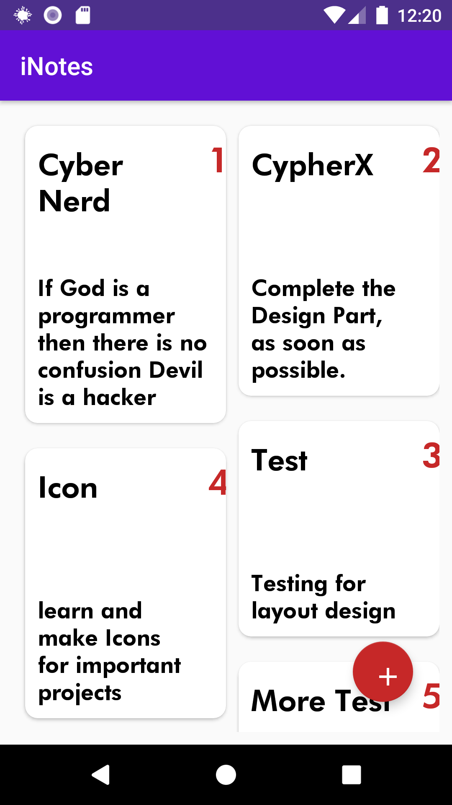
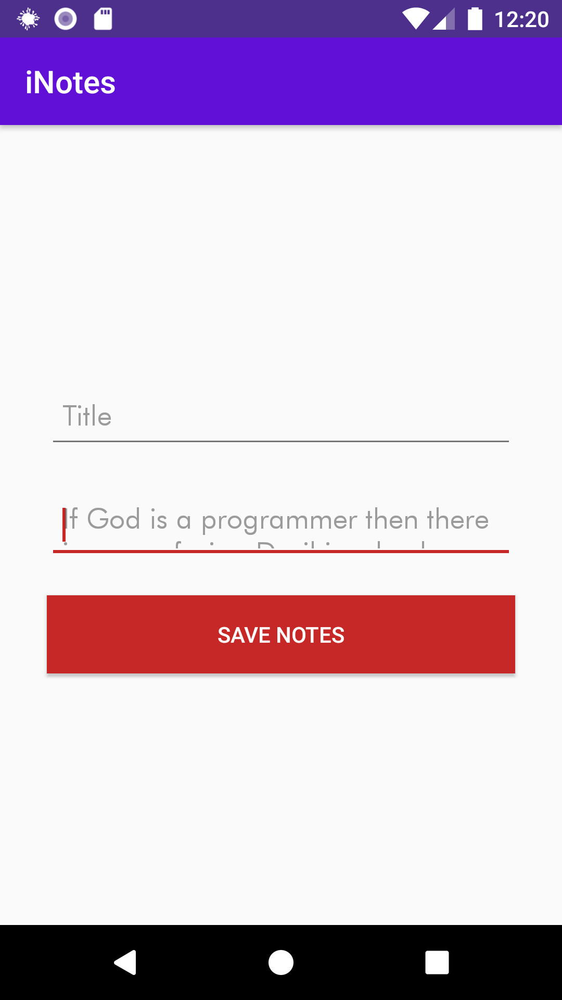
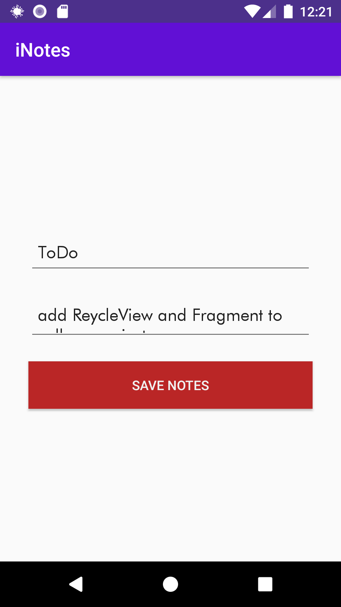

# StickyNotes-App
**Sticky Notes** is an Android application 📱 using Realm Database. Developed by CyberNerd. 
⍟ Offline Application no need to connect with the Internet. data save in local cache.
**Quick Snippet Application for Daily Task**

## support our work and do Star this Repository Or Fork this Repository

     
     
                                        

## Built With 🛠
- [Kotlin](https://kotlinlang.org/) - First class and official programming language for Android development.
- [Realm Database](https://realm.io/products/realm-database/) - Realm Database is a fast, easy to use, and open source alternative to SQLite and Core Data.

## Contribution 🙏🏻 are always Welcome ( fork this repository and make pull request)

